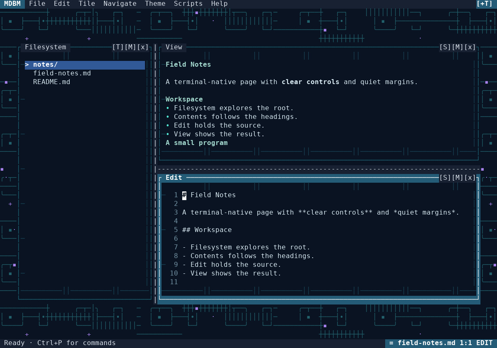

# mdbm

**A cell-native Markdown reader/editor for the terminal.**

Version **1.0.0a2** is a runnable implementation alpha, not a declaration that every acceptance gate in the supplied plan has passed. The application has one runtime Python source, `mdbm.py`. Themes are validated TOML data; they cannot execute code or operate the editor.



## Start on Windows

Extract the complete folder to a writable location. Install Python **3.11 or newer** if it is not already available. Open **`1Setup.cmd`** once to create a local virtual environment and install the declared dependencies. Then open **`0Start.cmd`**, preferably in Windows Terminal.

These launchers do not install Python, change system settings, or bypass failed dependency installation. Setup needs package-index access. An existing environment is reused; it is not deleted.

From a terminal in the extracted folder:

```powershell
py -3 -m venv .venv
.venv\Scripts\python.exe -m pip install -r requirements.txt
.venv\Scripts\python.exe mdbm.py examples\tour.md
```

Without a path, MDBM opens its welcome document or offers the saved session. A file argument roots the workspace at that file's parent directory. A directory argument opens that directory as the workspace.

## Start on Linux or macOS

```sh
python3 -m venv .venv
.venv/bin/python -m pip install -r requirements.txt
.venv/bin/python mdbm.py examples/tour.md
```

Subsequently, `./start.sh` launches the same environment. The extracted source bundle is the recommended installation. Editable installation is also supported: `python -m pip install -e .`. A wheel includes the reference themes under `share/mdbm`; when running an installed wheel, place `mdbm.conf` in your working directory or pass `--config`. Scripts in a wheel installation still follow the explicit sibling-of-`mdbm.py` policy; the extracted bundle is more convenient for that workflow.

## Using the workspace

Filesystem occupies the left column; its **[T]** button switches to Contents without discarding tile memories. View starts above Edit. The right-hand **[S]** buttons swap their order; **[M]** opens a compact tile menu and **[x]** hides a tile. **[+T]**, the Tile menu and **Ctrl+T** restore hidden tiles. At small sizes the application shows one focused tile rather than crushing all four into unusable rectangles.

Clicking an unfocused tile focuses it and performs the clicked action. Drag in Edit to select text, double-click for a word, and triple-click for a line. Right-clicking inside a selection preserves it. Clicking ordinary preview text reveals its source block; existing editor selections are retained. Stale preview links/source maps are held until the current generation is ready.

Drag either one-cell divider with the left or right mouse button. Release commits; Escape rolls back. An outside click dismisses the top overlay without also editing the document. Theme selection is transactional: arrows preview, Enter commits, Escape restores the original. An uncommitted preview cannot leak into saved session state.

| Action | Keyboard |
| --- | --- |
| Command palette / emergency route | **Ctrl+P** |
| Restore all tiles | **Ctrl+T** |
| Open / new / save / Save As | **Ctrl+O / Ctrl+N / Ctrl+S / F4** |
| Quit, with dirty-state guard | **Ctrl+Q** |
| Focus next / previous tile | **Tab / Shift+Tab** |
| Direct tile focus | **Alt+1 … Alt+4** |
| Switch left tile / swap right tiles | **Alt+L / Alt+W** |
| Find / next / previous / replace | **Ctrl+F / F3 / F7 / F6** |
| Go to line or `line:column` | **Ctrl+G** |
| Undo / redo; select all | **Ctrl+Z / Ctrl+Y; Ctrl+A** |
| Copy / cut / application paste | **Ctrl+C / Ctrl+X / Ctrl+V** |
| Ribbon / guide / dismiss | **F10 / F1 / Escape** |

The palette exposes commands without dedicated shortcuts, including keyboard split resizing, theme selection, Contents filtering and script cancellation. Alt-prefixed keys can also be entered as Escape then the key where the terminal supports that convention. The ribbon uses a latched fallback, not a claim of portable Alt-key-release detection. Ctrl+H is kept compatible with Backspace; it is deliberately not Replace.

The clipboard is **application-local**. Pasting from the operating system uses the terminal's own paste shortcut and bracketed-paste protocol. MDBM does not write OSC-52 clipboard escapes. A documented Vim subset supplies Normal/Insert/Visual modes; it is not a full Vim emulator. The detailed keyboard/mouse and mode contracts are in `docs/MDBM_PRODUCT_SPEC.md` and F1.

## Reading and editing

The preview supports CommonMark, tables, task lists, strikethrough, HTTP(S) autolinks, footnotes and Pygments fenced-code styling. HTML is rendered literally, not executed. No remote images are fetched. Local links must remain in the rooted workspace; external browser links require confirmation.

Files are UTF-8. Existing BOMs and uniform newline conventions are preserved; mixed line endings are diagnosed and normalized to the dominant convention on save. Existing unsafe controls remain in the source but render as safe replacements. New pasted controls are sanitized. Combining marks and CJK widths are handled at cell boundaries; some ambiguous emoji/ZWJ sequences display as replacement cells while retaining their source.

Saves publish atomically and check disk fingerprints. Existing destinations, changed files, dirty navigation and exit all require the appropriate guard. Rename/move refuses overwriting an existing destination. Trash uses Send2Trash with **no permanent-delete fallback**. No-clobber creation requires hard-link support on the destination filesystem and fails safely when unavailable. These checks are not isolation from an adversarial process running as the same OS user.

## Appearance and configuration

MDBM now ships three original reference themes — `restrained-monochrome`, `neon-circuitry` and `dense-glitch-mosaic` — plus three animated examples: `maintenance-ecosystem`, `relay-moth-swarm`, and `diagnostic-aurora`. `minimal` remains embedded for recovery. The animated set is directly inspired by the motion language of `maintenance_ecosystem_v4_2`: service lamps/crawlers, relay moth formations, coolant and diagnostic aurora/arc effects, re-expressed strictly as safe theme data.

See `docs/screenshots/gallery.html` for static compositor snapshots and `docs/screenshots/animated/gallery.html` for GIF captures generated from the actual compositor. Open `examples/animated-theme-showcase.md` in MDBM for a live tour. **F8** is bound to `cue.user-1` in the sample config so Maintenance Ecosystem and Diagnostic Aurora can fire their manual arc-storm demo.

```sh
python mdbm.py --theme maintenance-ecosystem examples/animated-theme-showcase.md
python mdbm.py --theme relay-moth-swarm examples/animated-theme-showcase.md
python mdbm.py --theme diagnostic-aurora examples/animated-theme-showcase.md
python mdbm.py --theme dense-glitch-mosaic
python mdbm.py --safe-theme --no-restore
python mdbm.py --validate-theme themes/neon-circuitry.theme
python mdbm.py --config mdbm.conf --diagnostics
python mdbm.py examples/tour.md --snapshot 120x40
```

`mdbm.conf` stays manually maintained; the program never rewrites its comments. It controls layout, artspace, input, appearance, capabilities, accessibility, scripts and recovery. Configuration bindings map a key sequence to an existing command ID. Invalid values fall back individually; conflicting bindings produce diagnostics. Some advanced semantic theme surfaces from the requested plan are not implemented yet; the implementation report identifies them rather than claiming complete 1.1 conformance.

Normal content is opaque to decoration. Immersive behind-content art is opt-in; protected focus, selection, cursor, controls, menus and confirmations remain host-owned. Motion can be off, reduced, normal or high, with user accessibility settings taking precedence. Spatial/glyph tracks may run at the bounded theme cadence; whole-style, palette and visibility transitions remain capped at 2 Hz. Themes have strict size, reference, art, layer, frame and per-frame paint budgets.

## Recovery and scripts

Session and recovery data live in the configured local `.mdbm/` directory. A dirty recovery snapshot is separate from the source file: it does **not** silently save over that file. Restoring it retains the original disk fingerprint, so later external edits still trigger conflict checks. Snapshots are local plaintext, not encrypted. A second instance cannot take over another instance's state lock. Copy the source files and recovery directory before destructive troubleshooting.

Scripts are trusted programs, **not a sandbox**. Only explicitly allowlisted `.py` siblings of `mdbm.py` are shown; `mdbm.py` itself is excluded. Arguments must be a JSON array such as `["a path with spaces", "--check"]`. The host invokes the current interpreter with shell disabled and captures bounded output. Themes and documents cannot launch them. POSIX cancellation terminates the process group; Windows cancellation currently targets the launched process, not every descendant.

## Verification and release status

```sh
python -m pip install -e ".[test]"
python -m pytest -q
python tests/performance_probe.py --output docs/verification/performance.json
python tests/render_gallery.py
python tests/render_animation_gallery.py
```

The delivered verification report records **513 passing tests**, including **96 deterministic golden configurations** and **four real POSIX pseudo-terminal tests**. Tests cover editing, geometry, source maps, modal interactions, conflict-safe files, recovery, scripts, malformed themes and bounded decoration. Golden baselines are implementation regression fixtures, not an independent visual oracle. `tests/update_goldens.py` updates them explicitly; review the gallery rather than accepting changed hashes blindly.

The local environment had prompt-toolkit 3.0.52, below the declared 3.0.53 minimum, and lacked `mdit-py-plugins`. Therefore these results use the visibly diagnosed bootstrap parser path. The requirement bounds have **not** been weakened. The supplied CI workflow requires the release dependency path, but that remote workflow has not been run here.

Native Windows Terminal, macOS/Linux GUI-terminal acceptance, strict release-dependency verification, end-to-end latency under load, and accessibility/flash auditing remain open. Large-document parsing is full-document, not incremental: the included 100,000-line probe took approximately **22 seconds** to generate its preview with approximately **191 MiB** process peak memory. File operations/recovery writes remain synchronous. Do not equate fast small-document composition with passing the full latency requirement.

Start with copies of valuable documents while evaluating this alpha. The exact delivered scope, remaining gaps, measurements and commands are in **`docs/IMPLEMENTATION_REPORT.md`**.

## Package map

`mdbm.py` is the sole runtime Python source; `mdbm.conf` and `themes/*.theme` are data. `examples/tour.md` is an interactive exercise; `examples/animated-theme-showcase.md` is the live animated-theme tour. `tests/` contains non-runtime checks, fixtures, the benchmark and gallery tools. `docs/` contains the product and technical contracts, config/theme specifications, security model, acceptance plan, roadmap, implementation prompt, original requested plan, measured verification data and screenshots. The supplied CI definition is under `.github/workflows/`.
